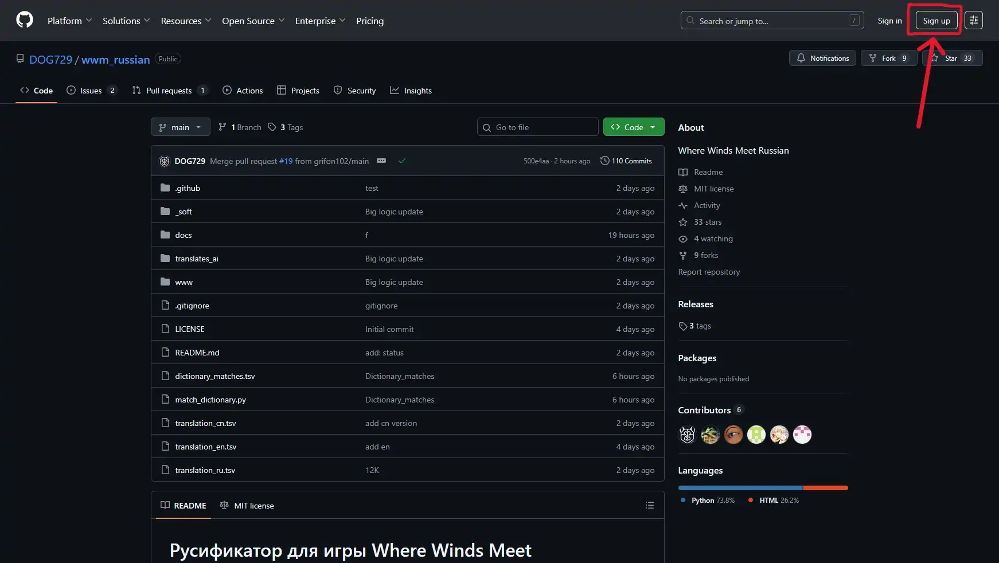
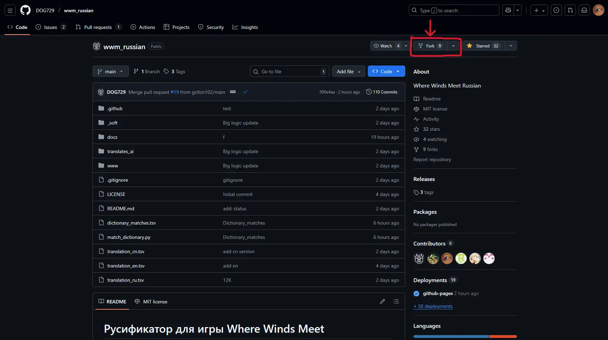
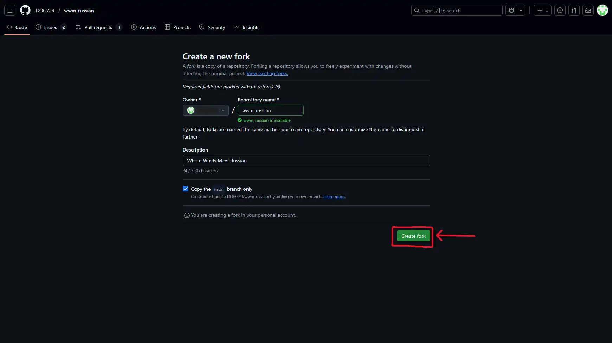
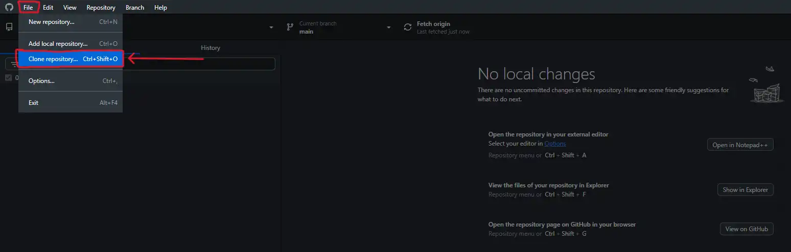
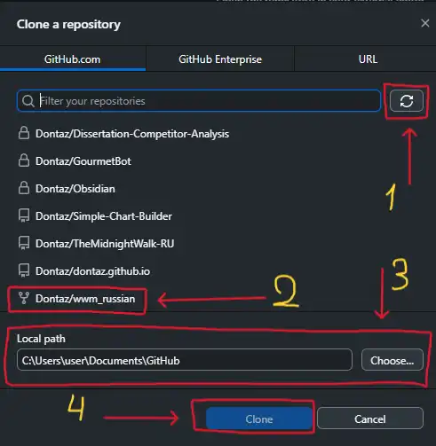
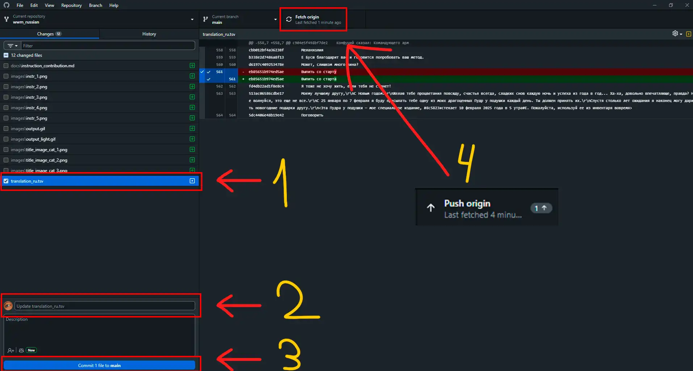
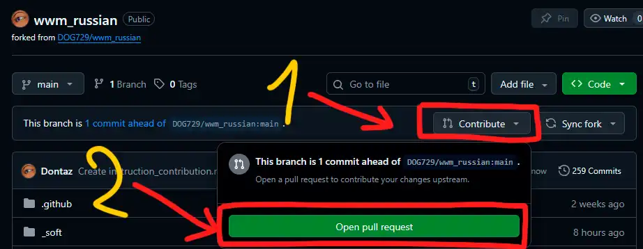
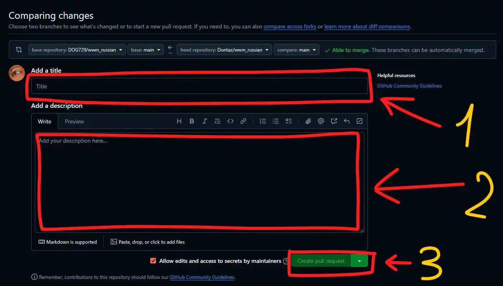

# Инструкция по помощи в переводе на GitHub

## Шаг 1 

Зарегистрируйтесь (см. рисунок ниже) на GitHub, либо войдите в свой аккаунт.

---

## Шаг 2 

1. Заходите на [страницу репозитория](https://github.com/DOG729/wwm_russian).
2. [Делаете Fork](https://github.com/DOG729/wwm_russian/fork) (см. рисунок ниже).

---

## Шаг 3

Нажимаете «Create fork» (см. рисунок ниже).

---

## Шаг 4

1. Скачиваете программу [GitHub Desktop](https://desktop.github.com/download/).
2. Заходите в ней в свой аккаунт.
3. Нажимаете «File» (см. рисунок ниже) и выбираете «Clone repository» (или сочетание клавиш «Ctrl + Shift + O»).

---

## Шаг 5

1. Перед вами выйдет список ваших репозиториев. Если список пуст нажмите на кнопку обновления (см. пункт 1 на рисунке). 
2. Выбираете в списке ваш Fork репозитория (см. пункт 2 на рисунке).
3. Выберите путь, куда хотите сохранить репозиторий (см. пункт 3 на рисунке).
4. Нажмите на кнопку «Clone» (см. пункт 4 на рисунке).

---

## Шаг 6

1. Зайдите по пути, куда вы сохранили репозиторий.
2. Редактируйте нужный файл по [инструкции](../docs/localization.md).
3. После редактирования зайдите в программу GitHub Desktop.
4. Поставьте галочку напротив файла, который хотите обновить (см. пункт 1 на рисунке), обычно сразу стоит.
5. Вписать титул и описание (см. пункт 2 на рисунке).
6. Нажмите «Commit X file to main» (см. пункт 3 на рисунке).
7. Нажмите «Push origin» (см. пункт 4 на рисунке).

> Не забывайте обновлять свой локальный репозиторий до свежей версии, для этого нажмите «Pull», которая будет там, где и кнопка под пунктом 4 на рисунке. Если такой кнопки нет, то попробуйте в том же месте нажать «Fetch origin». Если и после этого не будет кнопки «Pull», значит у вас уже самая свежая версия.

---

## Шаг 7

1. Зайдите на страницу своего форка (не на страницу основного репозитория). Страницу можете найти по клику на ваш профиль (аватарка на сайте справа-сверху) → «Repositories» и выбрать ваш Fork.
2. На странице форка нажмите «Contribute» (см. пункт 1 на рисунке) и в высвечивающемся окне нажмите «Open pull request» (см. пункт 2 на рисунке).

---

## Шаг 8

1. Откроется новая страница.
2. Впишите титул изменения в поле «Title», например, «Перевод строк 1000-1500» (см. пункт 1 на рисунке).
3. При необходимости подробно распишите, что было сделано в поле «Description» (см. пункт 2 на рисунке).
4. Нажмите «Create pull request» (см. пункт 3 на рисунке).
5. Всё готово, ждите одобрения изменений.

